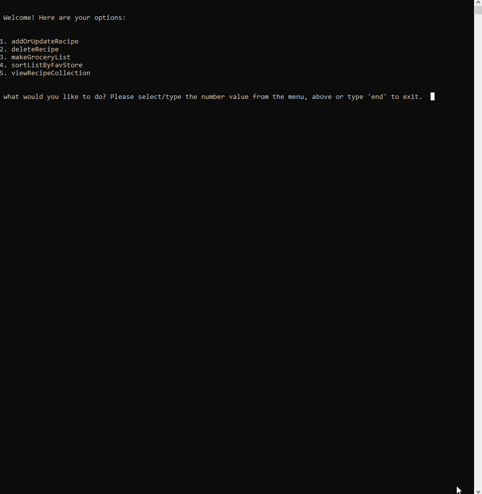

<h1>Shopping List 2018</h1>

## Purpose
Personal Project: A shopping list program that helps me build and sort my shopping list mroe quickly and accurately.

## Skills
This is the first personal project I created as I neared the end of my online Coursera courses introducing students to Python. I used the elements of a directory I built and used that to create the options list; I also implemented many new approaches that I found from online research so that I could realize the details I had envisioned.

<ul>
<li>Python</li>
<li>JSON</li>
</ul>

## Features

<ul>
<li>User can create, read, update and delete recipies in order to store favorite recipies in one place;</li>
<li>User can select from recipies in order to automatically produce a shopping list of ingredients; </li>
<li>User can sort grocery list by store in order to better organize their shopping trips.</li>
</ul>

## Intended Updates
This project uses a JSON file to store the data, however I had discovered that approach through research and was unaware of what that was upon building this app.The following initial changes will be made in the future:

<em>NEW TECHNOLOGY</em>
<ul>
<li>Django</li>
<li>PostgreSQL</li>
</ul>

<em>NEW FEATURES</em>
<ul>
<li>Build a GUI;</li>
<li>store to a SQL database using MySQL or PostgreSQL.</li>
</ul>

